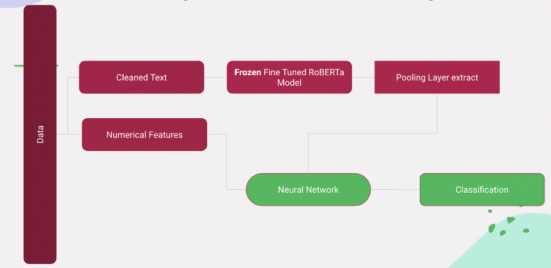

# Suicide detection using BERT/RoBERTA

## Architecture

The goal to develop a predictive computation model using features of posts from r/suicidewatch channel dataset on Reddit.
The data is curated and obtained from University of Maryland, Reddit Suicidality Dataset.

## Files
The folder contains the following major files 
1. traning_testing_modeling_part_1_of_3.ipynb 
2. pre_processing_unseen_data_part_2_of_3.ipynb 
3. sentence_encoder_part_3_of_3.py 
4. nlp_helper_functions.py [Not to be run; It will be used by other notebooks and scripts] 
5. DataPreprocessing_DL.ipynb - Data Preprocessing for Deep Learning Models 
6. utils.py. - Utils/Helper python file 
7. Train_Transformer.ipynb - ROBERTa trainer and fine tuning 
8. Train_Numerical.ipynb - Only Numerical Features Neural Network (Maybe we can ignore this?) 
9. Train_Hybrid.ipynb - Our Hybrid Architecture Fine Tuned ROBERTA + Numerical Features

## Data Processing
On this data, we perform 
a. Preprocessing: Concatenate different posts of the same user, combine the title
b. Data cleaning: remove stopwords, punctuations, symbols, and convert to lower case
c. Feature engineering: Length of posts, Number of posts per user, Emotional lexicons (Joy, Anger, Sadness, Disgust), Sentence Polarity(Positive, Negative)
d. Perform t-test to check for normality
e. Add custom prompts for Inverse Suicidal degree
f. Extract all features as numeric
